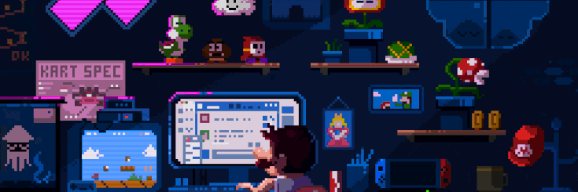

## Hai Kawan 👋
---

<!-- 
 -->

<!--
**Moelmo/Moelmo** is a ✨ _special_ ✨ repository because its `README.md` (this file) appears on your GitHub profile.

<!-- Here are some ideas to get you started:

- 🔭 I’m currently working on ...
- 🌱 I’m currently learning ...
- 👯 I’m looking to collaborate on ...
- 🤔 I’m looking for help with ...
- 💬 Ask me about ...
- 📫 How to reach me: ...
- 😄 Pronouns: ...
- ⚡ Fun fact: ....
-->
---
## 📝 **About Me**

Saya adalah seorang penggemar Python yang senang mengeksplorasi berbagai ide melalui pemrograman. Bagi saya, Python bukan sekadar bahasa pemrograman, tetapi alat untuk menciptakan solusi sederhana yang efisien dan menyenangkan untuk dikembangkan.

Saya terbiasa membuat berbagai proyek pribadi, hingga eksperimen kecil yang bertujuan untuk meningkatkan produktivitas. Dengan pendekatan yang santai namun konsisten, saya percaya bahwa proses belajar yang menyenangkan akan menghasilkan karya yang bermanfaat.

> "Code less, create more — Python makes it possible."

>🌱 I’m currently learning [**Python**](https://www.python.org/)

---
### 📚 Skills Language And Framework

  
  
  
  
  

---

### 🌐 Sosial Media

  
  
  

---
### 📈 **Statistik GitHub Saya**

  
  
  

---

### 🎵 Spotify Recently Played

  

###
---
## 📩 **Kontak**

  
    

###
 

---

  <strong>Contributions in the last year</strong>

---

### Play with me 🐍

---
